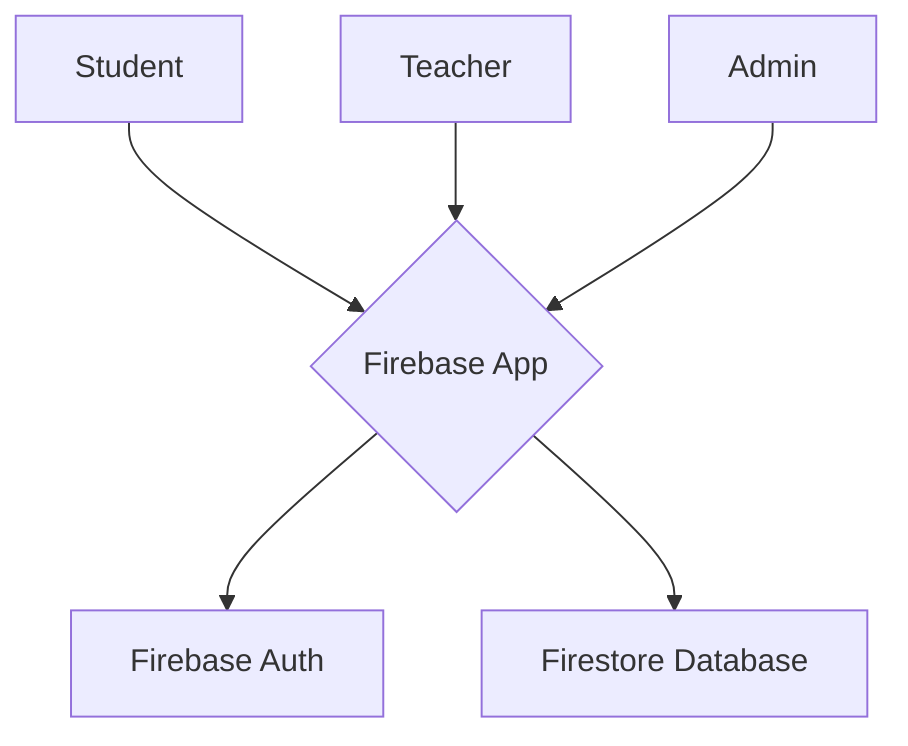

# Student–Teacher Appointment System

<p align="center">
  
  
  
</p>

A web-based platform for students to book appointments with teachers based on their availability. Built with vanilla JavaScript and powered by Google Firebase.

**Live Demo:** [View the Live Site](https://student-teacher-appointm-285c2.web.app)

<br>

<p align="center">
  
  <br>
  
</p>

---

## Table of Contents

- [Key Features](#key-features)
- [Technology Stack](#technology-stack)
- [System Architecture](#system-architecture)
- [Getting Started](#getting-started)
- [Deployment](#deployment)

---

## Key Features

This project contains three main user roles with distinct functionalities:

#### 👨‍💼 Admin
-   **Dashboard:** Secure login to the admin panel.
-   **Teacher Management:** Add, update, and delete teacher profiles.
-   **Student Approval:** View and approve pending student registrations.

#### 🧑‍🏫 Teacher
-   **Dashboard:** Secure login to the teacher dashboard.
-   **Availability Management:** Set and manage weekly availability slots for student bookings.
-   **Appointment Management:** View, approve, or cancel pending appointment requests from students.

#### 👨‍🎓 Student
-   **Authentication:** Securely register for a new account and log in.
-   **Teacher Discovery:** Search for teachers by name or subject.
-   **Booking Workflow:** Select a teacher, view their available dates and times, and book an appointment with a purpose message.
-   **Status Tracking:** View a list of their own booked appointments and their current status (Pending, Approved, Cancelled).

---
## Screenshots

| Login & Register Page | Student Dashboard | Teacher Dashboard | Admin Dashboard |
| :---: | :---: | :---: | :---: |
|  |  |  |  |

---

## Technology Stack

-   **Frontend:** HTML5, CSS3, JavaScript (ESM), Bootstrap 5
-   **Backend & Database:** Google Firebase
    -   **Authentication:** For user registration and login.
    -   **Firestore:** As the NoSQL database for all application data.
    -   **Hosting:** For cloud deployment.

---

## System Architecture

The system uses a client-server architecture where the frontend client communicates directly with Firebase services.

-   **Client (Browser):** A static web application built with HTML, CSS, and Bootstrap. All dynamic behavior is handled by modular JavaScript.
-   **Backend (Firebase):** Google Firebase provides the backend-as-a-service. It handles user identity and stores data in Firestore collections.


## Getting Started

To get a local copy up and running, follow these simple steps.

### Prerequisites

-   A modern web browser (e.g., Chrome, Firefox).
-   A code editor (e.g., VS Code).
-   A Google account to create a Firebase project.

### Local Setup

1.  **Clone the repository:**
    ```bash
    git clone https://github.com/Vinodhacker17/Student-teacher-appointment-system.git
    cd Student-teacher-appointment-system
    ```

2.  **Set up your Firebase Credentials:**
    -   In the Firebase Console, create a new project and then create a **Web App**.
    -   Firebase will provide you with a `firebaseConfig` object.
    -   In the project folder, create a new file named `firebase-config.js`.
    -   Copy the following code into your new `firebase-config.js` file and paste your credentials into the `firebaseConfig` object.
        ```javascript
        // firebase-config.js
        import { initializeApp } from "https://www.gstatic.com/firebasejs/10.12.0/firebase-app.js";
        import { getAuth } from "https://www.gstatic.com/firebasejs/10.12.0/firebase-auth.js";
        import { getFirestore } from "https://www.gstatic.com/firebasejs/10.12.0/firebase-firestore.js";

        // IMPORTANT: Paste your own Firebase config object here
        const firebaseConfig = {
          apiKey: "YOUR_API_KEY",
          authDomain: "YOUR_AUTH_DOMAIN",
          projectId: "YOUR_PROJECT_ID",
          storageBucket: "YOUR_STORAGE_BUCKET",
          messagingSenderId: "YOUR_MESSAGING_SENDER_ID",
          appId: "YOUR_APP_ID"
        };

        const app = initializeApp(firebaseConfig);
        const auth = getAuth(app);
        const db = getFirestore(app);

        export { auth, db };
        ```
    *This file is listed in `.gitignore` and will not be pushed to GitHub, keeping your keys safe.*

3.  **Enable Firebase Services:**
    -   In your Firebase project console, go to **Authentication** and enable the **Email/Password** sign-in provider.
    -   Go to **Firestore Database** and create a database. Start in **test mode** for easy setup.

4.  **Run the Project:**
    -   Use a live server extension in VS Code to open `index.html`.

---

## Deployment

This project can be deployed globally using Firebase Hosting.

1.  **Install Firebase CLI:**
    ```bash
    npm install -g firebase-tools
    ```
2.  **Login to Firebase:**
    ```bash
    firebase login
    ```
3.  **Initialize Firebase:**
    ```bash
    firebase init
    ```
    -   Select **Hosting: Configure files for Firebase Hosting...**.
    -   Choose your existing Firebase project.
    -   Set your public directory to `.` (the root directory).
    -   Configure as a single-page app: **No**.

4.  **Deploy:**
    ```bash
    firebase deploy
    ```